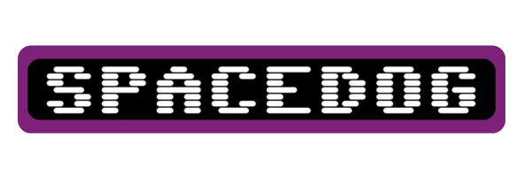

<h2 align="center">
  
    A spaceman inspired game...
</h2>

by Gabrielle Tongol

“SpaceDog”, inspired by the classic “Spaceman” game. The mechanics will remain the same as the inspired game but spacedog will introduce a theme revolving around aliens and a dog. 
In Spacedog, players must prevent a dog from being abducted by aliens. The objective is to correctly guess the word by selecting letters. Each incorrect guess brings the dog closer to abduction

## 🛸 GAME MECHANICS 
- Player is given a word initialized by blanks, the goal is to complete the word by selecting a 
letter from the keyboard 
- Player is given 5 chances to complete the word
- Each incorrect letter will decrease the number of chances 

## 🛸 SCREENSHOTS 

## 🛸 TECHNOLOGIES USED 
- HTML
- CSS
- JavaScript
- [Animate.css](https://animate.style/)

## 🛸 GETTING STARTED 

here is the link to play: 
https://gabvint.github.io/spacedog-game/

## 🛸 FUTURE PLANS 
- File Handling for the word lists
- Player gets to choose difficulty level and theme 
- Enhance responsiveness for different device sizes
- Use database to register players and their scores 

